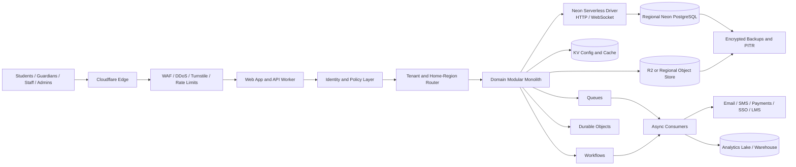
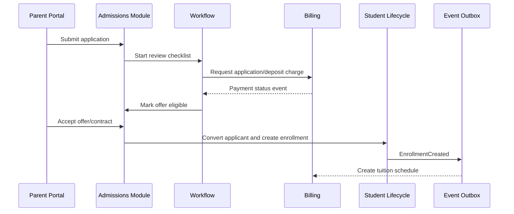

# 05 — Target System Architecture

## 1. Architecture style

The application starts as a **domain-oriented modular monolith** deployed on Cloudflare Workers, backed by regional Neon Serverless PostgreSQL. Modules share one deployment initially but communicate through explicit application interfaces and domain events. Infrastructure-specific code is isolated behind adapters.

This provides:

- Strong transactions where domains genuinely need them
- One deployment and observability surface for a small team
- Clear module ownership and future extraction paths
- Fewer distributed-system failure modes during product discovery

## 2. High-level deployment architecture



### Neon connection rules

- Use `@neondatabase/serverless` HTTP queries for short, one-shot and non-interactive database operations.
- Use request-scoped WebSocket `Pool`/`Client` connections only for interactive multi-statement transactions.
- Use the Neon pooled endpoint for serverless burst traffic where pooling is appropriate.
- Create, use and close WebSocket connections inside the Worker request or background execution lifetime; no connection may outlive its execution context.
- Keep tenant context transaction-local and verify it cannot leak through pooling.
- Use a separate Neon database branch for each Git module branch/worktree and preview environment, with synthetic data only.
- Hyperdrive is not part of the default path. It may be tested later behind the database adapter without changing domain code.

## 3. Logical layers

### 3.1 Experience layer

Applications:

- School administration web app
- Teacher web/PWA app
- Parent/guardian web and mobile app
- Student web and mobile app
- Admissions portal
- Public forms and payment pages
- Platform operations console

Rules:

- UI never embeds authorization decisions.
- Every screen consumes permission-aware application APIs.
- Persona-specific navigation is generated from capabilities and context.
- Sensitive records are protected against browser caching and accidental downloads.
- Low-bandwidth mode reduces payloads and postpones non-critical media.

### 3.2 Edge gateway

Responsibilities:

- Custom-domain resolution
- Tenant identification
- Region routing
- Authentication/session verification
- Request ID and trace context
- Rate limiting and bot mitigation
- Request-size limits and content-type validation
- Idempotency-key enforcement for selected commands
- API version negotiation
- Security headers and CORS policy

The gateway must not contain business rules such as enrollment eligibility or accounting calculations.

### 3.3 Identity and policy layer

Components:

- Identity provider adapter
- User/person account linking
- Tenant membership
- Role and permission catalog
- Scope policies: tenant, legal entity, campus, department, class, student relationship
- Attribute policies: employment status, guardian relationship, assigned class, case membership
- Sensitive-field masking
- Break-glass workflow
- Support impersonation/access workflow with customer approval

Authorization decision inputs include:

- Actor identity
- Tenant and region
- Active membership
- Requested action
- Resource classification
- Relationship/scope
- Purpose and support context
- Time and session assurance level

### 3.4 Application layer

Use command/query separation at the application-service level without introducing a separate distributed CQRS platform.

- **Commands** validate intent, authorization and invariants, then commit transactional changes.
- **Queries** use permission-aware read services and purpose-built projections.
- **Domain events** are recorded in the same transaction through an outbox.
- **Async consumers** perform notifications, exports, webhooks and analytical projection.

### 3.5 Domain layer

Recommended module boundaries:

```text
platform
├── tenancy
├── identity-access
├── localization-country-packs
├── workflow-approvals
├── audit-compliance
├── documents
├── notifications
├── integration-platform
└── reporting-platform

school-core
├── organization-campus
├── people-households
├── admissions
├── student-lifecycle
├── curriculum-catalog
├── scheduling
├── attendance
├── assessment-gradebook
└── records-transcripts

school-erp
├── billing-receivables
├── accounting-ledger
├── procurement-payables
├── hr-staff
├── payroll-adapters
├── inventory-assets
├── library
├── transport
├── hostel
├── cafeteria
└── activities-trips

student-support
├── health
├── wellbeing-pastoral
├── behavior
├── safeguarding
└── learning-support
```

Each module must define:

- Owned entities/tables
- Public commands and queries
- Events emitted and consumed
- Permission vocabulary
- Data classifications
- Invariants
- Reporting projections
- Import/export contracts

A module cannot directly edit another module’s owned tables. Cross-module behavior goes through application interfaces or events. Carefully documented transaction coordinators may call multiple modules for operations that must be atomic, such as applicant conversion plus enrollment creation.

## 4. Recommended repository shape

```text
apps/
  web-admin/
  web-family/
  web-student/
  worker-api/
  worker-jobs/
packages/
  domain/
    tenancy/
    people/
    admissions/
    enrollment/
    academics/
    attendance/
    grading/
    billing/
    ledger/
  application/
  policy/
  database/
  events/
  localization/
  integrations/
  ui/
  observability/
  testing/
infra/
  cloudflare/
  database/
  environments/
docs/
```

This is a proposed future layout, not an instruction to scaffold code before the design is approved.

## 5. Regional routing model

### Tenant directory

A minimal globally available tenant directory contains only routing-safe metadata:

- Tenant ID
- Verified domains
- Home region
- Deployment/database profile
- Authentication policy reference
- Status and maintenance flag

It must not contain student records, balances or sensitive configuration.

### Request flow

1. Edge gateway resolves tenant from domain/session.
2. It validates the tenant status and selects the home-region service/database binding.
3. The application reads/writes authoritative data only in that region.
4. Static assets and public-safe configuration can be cached globally.
5. Responses containing sensitive data use restrictive cache headers.

### Region migration

A region migration requires:

- Contract/legal approval
- Full backup and checksum
- Write freeze or controlled change capture
- Database and object copy
- Reconciliation of row counts, hashes, balances and files
- Tenant directory switch
- Post-migration observation
- Old-region retention and destruction according to policy
- Immutable migration audit record

## 6. Data and storage responsibilities

### PostgreSQL

Authoritative storage for:

- Tenant/campus configuration
- Identities, memberships and policies
- People, guardians and students
- Admissions and enrollment
- Academics, attendance and grades
- Billing, payments and accounting
- Staff and operations
- Workflow state requiring transactions
- Audit metadata and outbox

### Object storage

Stores:

- Uploaded documents
- Profile and evidence images
- Generated reports and exports
- Signed contracts
- Large import files
- Archived evidence packages

Database rows store object metadata, classification, owner, checksum, retention and access policy—not raw file bytes.

### KV

Stores only non-authoritative or reproducible data:

- Translation bundles
- Public branding/configuration cache
- Feature configuration cache
- Country-pack manifests
- Short-lived tenant routing cache

### Queues

Topics/queues should be separated by workload and sensitivity:

- Notification delivery
- Integration webhooks
- Import processing
- Export/report generation
- Search indexing
- Analytics projection
- File scanning
- Payment-provider events

Queue messages contain identifiers and minimal context, not full student records. Consumers reload authorized data from the home region.

### Workflows

Suitable workflows:

- Admissions application processing and reminders
- Offer/contract lifecycle
- Academic year rollover
- Bulk enrollment/import
- Invoice generation and dunning
- Refund approval and settlement
- Data export/deletion request
- Region migration orchestration
- Regulatory report generation

### Durable Objects

Use only where single-entity coordination is valuable:

- Real-time attendance session presence
- Concurrent timetable editing lock
- WebSocket room for controlled live updates
- Tenant/document number allocation if database sequences are not appropriate
- Rate/concurrency coordination for provider APIs

Do not put broad student or finance state in Durable Objects.

## 7. Core transaction patterns

### 7.1 Transactional outbox

Every domain event is inserted into `outbox_event` in the same PostgreSQL transaction as the business change. A dispatcher publishes it to queues. The event remains replayable and has delivery status.

Benefits:

- No “database committed but event lost” gap
- Safe retries
- Auditable integration history
- Rebuildable read/analytics projections

### 7.2 Idempotency

Required for:

- Payment initiation and callbacks
- Attendance offline synchronization
- Student/application imports
- Invoice generation
- Refunds
- External webhook processing
- Mobile retries

Persist idempotency keys with actor/tenant, request fingerprint, result reference and expiry. A reused key with a different request must fail.

### 7.3 Optimistic concurrency

Mutable aggregates use a version number or updated-at precondition. Gradebook publication, timetable changes, enrollment status and configuration updates must detect lost updates.

### 7.4 Reversal instead of deletion

Financial postings, published grades, finalized attendance and disclosure logs are corrected through explicit reversal/amendment records. Original evidence remains immutable.

## 8. Representative data flows

### 8.1 Applicant to enrolled student



The conversion command must preserve the original application, link it to the new student and prevent duplicate conversion.

### 8.2 Attendance capture

1. Teacher downloads permission-scoped roster and attendance session.
2. Entries are saved locally if connectivity is weak.
3. Client sends a batch with session ID, record IDs and idempotency key.
4. Server checks teacher assignment, session state and version.
5. Database transaction upserts attendance and writes audit/outbox events.
6. Threshold rules asynchronously trigger guardian notifications.
7. Office corrections create amendment records with reasons.

### 8.3 Invoice and payment

1. Billing module creates invoice lines from versioned fee rules.
2. Posting engine creates balanced journal entries.
3. Payment provider callback is authenticated and idempotently recorded.
4. Payment is allocated to invoice(s).
5. Ledger postings are created; balances are derived, not manually overwritten.
6. Receipt generation and notification occur asynchronously.
7. Reconciliation links provider/bank settlement to platform payment.

## 9. Integration architecture

### Inbound

- REST/OpenAPI
- Signed webhooks
- OneRoster CSV/REST
- Secure CSV/XLSX import
- SFTP/file-drop adapter
- Payment callbacks
- Identity federation

### Outbound

- Signed, retryable webhooks
- Scheduled exports
- OneRoster/LTI/Ed-Fi/SIF adapters
- Accounting/payroll/payment connectors
- Email/SMS/push providers
- Data warehouse/BI export

### Integration controls

- Per-tenant credentials and scopes
- Secret rotation
- IP/mTLS options for enterprise
- Rate limits and quotas
- Schema/version registry
- Dead-letter queue and replay
- Payload minimization
- Delivery and disclosure audit
- Sandbox credentials/environment

## 10. Reporting architecture

Operational screens use indexed PostgreSQL queries and purpose-built projections. Heavy reports do not execute synchronously against transactional tables.

Recommended pattern:

1. Domain transaction commits and emits outbox event.
2. Analytics consumer creates de-normalized, permission-aware reporting facts.
3. Periodic snapshots move approved data to a regional analytics store/lake.
4. Report service runs asynchronously and stores generated files.
5. User receives a signed, short-lived download link after authorization is rechecked.

Metric definitions live in a governed catalog with:

- Name and business meaning
- Formula
- Source fields/events
- Dimensions and filters
- Refresh frequency
- Data owner
- Privacy classification

## 11. Search architecture

Start with PostgreSQL full-text/trigram search for scoped people, students, invoices and documents metadata. Introduce a dedicated search service only when measured scale or relevance needs justify it.

Search requirements:

- Tenant and permission filters are mandatory
- Sensitive fields excluded from general search
- Search index deletion follows source deletion/retention
- Result snippets must not leak masked fields
- Index rebuild is reproducible from authoritative data

## 12. Error handling and resilience

- External provider failure cannot roll back already committed core transactions.
- Provider calls happen after commit unless the provider response is itself required to make the transaction valid.
- Retry only retryable errors with exponential backoff and jitter.
- All async consumers are idempotent.
- Dead-letter queues generate actionable alerts and tenant-visible status where appropriate.
- Circuit breakers prevent a failing provider from exhausting Worker/database resources.
- User errors use localized, non-sensitive messages and stable error codes.
- Correlation IDs connect user request, transaction, queue event and provider call.

## 13. Deployment and environment model

Environments:

- Local developer environment
- Shared integration environment with synthetic data
- Regional staging environments
- Regional production environments
- Optional dedicated enterprise environments

Rules:

- Production data is never copied to development.
- Schema changes use reviewed migrations and expand/migrate/contract deployment.
- Feature flags decouple deployment from release.
- Country packs and policy versions are immutable after activation; changes create new versions.
- Infrastructure is defined as code.
- Secrets are managed through platform bindings/secrets stores, not repository files.

## 14. Extraction path to services

A module can become a separate Worker/service only when one or more conditions exist:

- Independently high scale or latency requirements
- Strong security/isolation boundary
- Separate team ownership and release cadence
- Different runtime requirement, such as a timetable solver
- Failure isolation materially improves reliability
- Regulatory need for separate storage/deployment

Likely future extractions:

- Notification delivery
- Import/export processing
- Document generation
- Timetable optimization
- Analytics/report execution
- Search indexing

Identity, student lifecycle, enrollment and ledger should remain conservative because distributed consistency errors are expensive.

## 15. Architecture definition of done

Before a module enters production it must provide:

- Published module contract
- Database ownership map
- Authorization matrix
- Data classification
- Audit events
- Idempotency and concurrency behavior
- Events and integration schemas
- Failure/retry behavior
- Migration and export path
- Unit, integration, tenant-isolation and performance tests
- Metrics, alerts and support runbook
