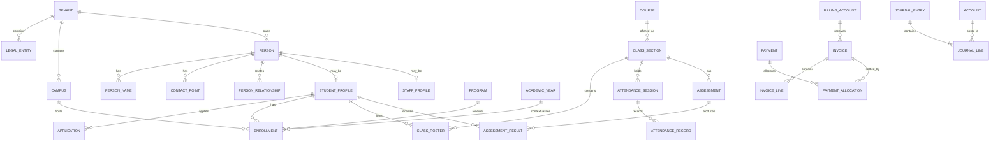

# 06 — Data Model and Database Design

## 1. Database decision

Use regional managed PostgreSQL as the authoritative transactional database.

Recommended baseline capabilities:

- ACID transactions and foreign keys
- Check, unique and exclusion constraints
- Row-level security for tenant defense in depth
- Declarative partitioning for high-volume history
- JSONB for bounded extension data, not core facts
- Full-text/trigram search for initial search needs
- Logical replication/change-data-capture where supported
- Point-in-time recovery
- Read replicas for selected reporting workloads

The exact PostgreSQL major version should be selected at implementation time from a provider-supported, stable version. Avoid tying the data model to provider-only SQL features unless there is an adapter and exit plan.

## 2. Multi-tenancy model

### Default pooled tenancy

Small and mid-sized tenants share a regional database and schema. Every tenant-owned table includes a non-null `tenant_id`.

Controls:

- Composite uniqueness includes `tenant_id`.
- Application opens each transaction with a verified tenant context.
- Row-level security policies restrict records to that tenant.
- Background jobs carry tenant and region context explicitly.
- Foreign keys between tenant-owned rows include or validate tenant consistency.
- Administrative cross-tenant operations use a separate, tightly controlled platform role.

### Dedicated tenancy

Large/regulatory tenants can receive:

- Dedicated database in a supported region
- Dedicated database credentials and connection pool
- Optional dedicated application deployment
- Tenant-specific backup/restore policy
- Contract-specific maintenance windows

The logical schema and application contract remain the same so movement between pooled and dedicated profiles is feasible.

### School-group sharing

A contracted tenant may contain multiple legal entities and campuses. Do not model each campus as a tenant merely for convenience. Cross-campus students, staff, families and consolidated finance need one tenant boundary with scoped authorization.

## 3. Identifier conventions

Recommended:

- Globally unique sortable identifiers such as UUIDv7 or ULID for application-visible primary keys
- Separate human-readable numbers such as student number, invoice number and receipt number
- Human numbers generated from versioned tenant sequences and never used as foreign keys
- External system identifiers stored in a dedicated mapping table
- No personally meaningful data encoded in primary keys

Every main table includes:

```text
id
 tenant_id              -- nullable only for true platform-global records
 created_at
 created_by
 updated_at
 updated_by
 version                 -- optimistic concurrency where mutable
```

Use `deleted_at` only where soft deletion is legally and operationally appropriate. Financial, audit and historical records use status/reversal, not soft delete.

## 4. Time, date and calendar rules

- Store instants as timezone-aware UTC timestamps.
- Store school-local calendar dates separately when the business meaning is a date, such as date of birth, attendance date or invoice due date.
- Store tenant/campus time zone as an IANA time-zone identifier.
- Never derive a historical local date using the tenant’s current time zone if the event stored its own zone/context.
- Academic years and terms are explicit records, not calculated from calendar year.
- Effective-dated records use `valid_from` and `valid_to` with non-overlap constraints where possible.

## 5. Money and accounting representation

- Every monetary amount has a currency code.
- Use fixed-precision decimal numeric columns suitable for the currency and calculation; never floating point.
- Maintain currency minor-unit rules in reference data.
- A legal entity has one functional ledger currency for a fiscal book.
- Foreign-currency transactions store transaction currency, functional amount and exchange-rate reference.
- Display balances are calculated from journal/subledger entries or maintained projections that can be rebuilt.
- Posted journal lines are immutable.

## 6. Core entity map



This is a conceptual map; module-level schemas contain more entities and history tables.

## 7. Platform and tenant tables

### Tenancy

- `tenant`
- `tenant_domain`
- `tenant_region_assignment`
- `tenant_deployment_profile`
- `tenant_feature_entitlement`
- `tenant_setting`
- `tenant_policy_version`
- `tenant_sequence`

### Organization

- `legal_entity`
- `campus`
- `organizational_unit`
- `department`
- `house`
- `room`
- `facility`
- `cost_center`

Important invariants:

- A campus belongs to one tenant and optionally one legal entity.
- A financial transaction belongs to exactly one legal entity/book.
- Tenant region changes occur only through a migration record and controlled workflow.
- Active custom domains are unique platform-wide after normalization.

## 8. Identity and access tables

- `identity_account`
- `identity_provider_link`
- `user_person_link`
- `tenant_membership`
- `role`
- `permission`
- `role_permission`
- `membership_role`
- `policy_assignment`
- `access_scope`
- `session_record`
- `mfa_method`
- `recovery_method`
- `support_access_request`
- `break_glass_access`
- `access_decision_log` for high-risk resources

Model principles:

- A login account is not the same as a person.
- One person may have multiple identity-provider links.
- Guardian access derives from both membership and current student relationship/authority.
- Teacher access derives from current assignment, campus scope and record classification.
- Platform support does not receive implicit tenant-data access.
- Sensitive case membership is explicit and time-bounded.

## 9. Person, household and relationship model

### Tables

- `person`
- `person_name`
- `person_identifier`
- `contact_point`
- `postal_address`
- `person_address`
- `household`
- `household_member`
- `person_relationship`
- `guardian_student_authority`
- `emergency_contact_authority`
- `authorized_pickup`
- `communication_preference`
- `consent_record`
- `person_document`
- `duplicate_candidate`
- `person_merge_record`

### Why relationships are explicit

A child can:

- Live in more than one household
- Have guardians with different legal, billing, communication and pickup rights
- Change custody arrangements over time
- Have a sponsor financially responsible but not legally responsible

Therefore a single `father_id`/`mother_id` model is invalid internationally.

### Relationship attributes

- Relationship type
- Effective dates
- Legal guardian authority
- Educational decision authority
- Billing responsibility
- Communication permission
- Pickup permission
- Portal access permission
- Court/restriction reference
- Verification status

Sensitive restriction details should be separately encrypted and visible only to appropriate roles.

## 10. Admissions model

### Tables

- `admissions_cycle`
- `enquiry`
- `applicant`
- `application`
- `application_program_choice`
- `application_form_version`
- `application_response`
- `application_document_requirement`
- `application_document`
- `application_checklist_item`
- `application_review`
- `application_score`
- `interview_event`
- `reference_request`
- `admissions_decision`
- `offer`
- `enrollment_contract`
- `application_payment`
- `applicant_conversion`

### Invariants

- An application references the exact form/schema version used at submission.
- Submitted responses are immutable; corrections create amendment versions.
- One accepted offer cannot create multiple student enrollments.
- Conversion records source-to-target field mappings and actor.
- Confidential references have separate authorization and disclosure policy.
- Application fees post through billing/ledger rather than a hidden admissions balance.

## 11. Student lifecycle and enrollment model

### Tables

- `student_profile`
- `student_number_assignment`
- `student_status_history`
- `program`
- `program_version`
- `grade_level`
- `cohort`
- `enrollment`
- `enrollment_status_history`
- `enrollment_transfer`
- `withdrawal_record`
- `promotion_decision`
- `graduation_record`
- `alumni_profile`
- `previous_school_record`
- `external_academic_record`

### Key distinction

- `student_profile` identifies the student role.
- `enrollment` states that the student participates in a program/campus/academic context for an effective period.
- `class_roster` states participation in a particular class section.

Never infer enrollment solely from a current grade field on the student.

### Invariants

- Enrollment periods for the same program/campus must follow configured overlap rules.
- Withdrawal/graduation closes or transitions related access and future attendance expectations.
- Historical enrollment cannot be overwritten by annual rollover.
- Student number uniqueness is tenant/campus policy-driven and effective-dated.

## 12. Academic structure model

### Tables

- `curriculum_framework`
- `curriculum_version`
- `learning_standard`
- `program`
- `program_requirement`
- `subject`
- `course`
- `course_version`
- `course_prerequisite`
- `course_credit_rule`
- `course_offering`
- `class_section`
- `class_staff_assignment`
- `class_roster`
- `homeroom_assignment`
- `student_pathway`

### Policy versioning

Course title, credits, grading rules and curriculum mappings can change. Historical class and transcript records reference immutable versions rather than current mutable definitions.

## 13. Calendar and timetable model

### Tables

- `academic_year`
- `academic_term`
- `instructional_calendar`
- `calendar_day`
- `holiday_closure`
- `bell_schedule`
- `bell_period`
- `rotation_cycle`
- `timetable_version`
- `class_meeting_pattern`
- `scheduled_class_meeting`
- `room_booking`
- `staff_availability`
- `substitution_assignment`
- `schedule_conflict`

### Invariants

- Published timetable versions are immutable; changes create a new version/effective schedule.
- Teacher, room and student collisions are validated.
- Attendance sessions reference a resolved scheduled meeting, not only a class ID.
- Time-zone and daylight-saving changes preserve local school intent.

## 14. Attendance model

### Tables

- `attendance_policy_version`
- `attendance_code`
- `attendance_session`
- `attendance_record`
- `attendance_amendment`
- `arrival_departure_event`
- `absence_notice`
- `attendance_finalization`
- `attendance_intervention`
- `attendance_sync_batch`

### Recommended record shape

An attendance record includes:

- Student
- Attendance session
- Code/status
- Minutes present/absent where needed
- Reason and evidence reference
- Source: teacher, office, device, import or guardian notice
- Recorded by and timestamp
- Current version
- Finalization state

### Invariants

- At most one current attendance result per student/session.
- Amendments preserve the previous value, actor and reason.
- Offline sync uses client-generated record IDs and batch idempotency.
- Finalized sessions require permission and reason to amend.
- Device attendance is evidence/input, not automatically trusted final truth.

### Partitioning

Partition `attendance_record`, `arrival_departure_event` and sync/event history by region and time, commonly monthly or by academic year depending on volume. Index by tenant, campus, date/session and student.

## 15. Assessment and gradebook model

### Tables

- `grading_policy_version`
- `grade_scale`
- `grade_scale_level`
- `assessment_category`
- `assessment`
- `rubric`
- `rubric_criterion`
- `assessment_result`
- `rubric_result`
- `grade_calculation_snapshot`
- `gradebook_lock`
- `grade_change_request`
- `reporting_period`
- `report_card_run`
- `report_card_result`
- `transcript_record`
- `credit_award`
- `gpa_calculation_snapshot`

### Invariants

- Published results reference exact policy, scale and calculation versions.
- Raw scores, exemptions and missing states are stored separately from displayed grades.
- Calculated grades have an explainable snapshot of inputs and formula.
- Grade changes after publication require amendment/reason/approval.
- Transcript entries are not recomputed from current policy without an explicit reissue process.

## 16. Billing and receivables model

### Tables

- `billing_account`
- `financial_responsibility`
- `fee_catalog_item`
- `fee_schedule`
- `fee_assignment`
- `billing_plan`
- `invoice`
- `invoice_line`
- `debit_note`
- `credit_note`
- `discount_award`
- `scholarship_award`
- `payment`
- `payment_provider_event`
- `payment_allocation`
- `refund`
- `receipt`
- `collection_case`
- `billing_statement_run`
- `bank_deposit`
- `bank_reconciliation_item`

### Invariants

- Invoice totals equal line net/tax totals according to the stored calculation snapshot.
- Payment allocation cannot exceed available payment or outstanding invoice amount except controlled credit behavior.
- Provider callbacks are unique by provider/event ID and idempotency key.
- Refunds reference original payment and approved amount.
- Voiding an invoice creates controlled reversal/credit behavior; it does not delete ledger evidence.
- Billing account may represent a household, sponsor, organization or government payer.

## 17. General ledger model

### Tables

- `accounting_book`
- `fiscal_year`
- `fiscal_period`
- `account`
- `account_dimension`
- `journal_entry`
- `journal_line`
- `posting_rule`
- `posting_rule_version`
- `source_document_link`
- `period_close`
- `manual_journal_approval`
- `ledger_reconciliation`
- `exchange_rate`

### Mandatory invariants

- Sum of debit equals sum of credit for every posted journal entry.
- A journal belongs to one tenant, legal entity, book and currency context.
- Posted lines are immutable.
- Corrections use a linked reversal and replacement entry.
- A closed period rejects new postings except through controlled reopening/adjustment policy.
- Every automated posting references its source document and posting-rule version.
- Receivable control-account balance reconciles to the receivable subledger.
- Sequence numbers are unique within their legal/fiscal scope.

### Database enforcement

Use database constraints and a controlled posting procedure/service. Application-only validation is insufficient for balanced journals.

## 18. HR and staff model

### Tables

- `staff_profile`
- `employment_record`
- `position`
- `staff_assignment`
- `employment_contract`
- `qualification`
- `certification`
- `background_check`
- `leave_type`
- `leave_request`
- `leave_balance_projection`
- `timesheet`
- `payroll_input_batch`
- `professional_development_record`
- `performance_cycle`

Employment and person data remain separate. One person can leave and return under a new employment record without losing history.

## 19. Health, wellbeing, behavior and safeguarding model

Separate schemas or clearly separated table ownership are recommended because authorization is materially stricter.

### Health

- `health_profile`
- `medical_condition`
- `allergy`
- `medication_authorization`
- `care_plan`
- `immunization_record`
- `clinic_visit`
- `health_document`

### Wellbeing/behavior

- `behavior_incident`
- `behavior_participant`
- `behavior_action`
- `pastoral_note`
- `support_referral`
- `support_plan`
- `accommodation_plan`

### Safeguarding

- `safeguarding_case`
- `safeguarding_case_member`
- `safeguarding_concern`
- `safeguarding_action`
- `safeguarding_disclosure`
- `safeguarding_external_report`

### Controls

- Explicit case membership and purpose
- Field/document classification
- Access/read logging, not only writes
- Restricted exports
- No broad report-builder access
- Legal hold and jurisdiction-specific retention
- Break-glass with reason, alert and review

## 20. Operational modules

### Library

- `library_title`, `library_copy`, `library_member`, `library_loan`, `library_reservation`, `library_fine`

### Inventory/procurement/assets

- `item`, `warehouse_location`, `stock_movement`, `supplier`, `requisition`, `purchase_order`, `goods_receipt`, `vendor_invoice`, `asset`, `asset_assignment`, `maintenance_work_order`

### Transport

- `transport_route`, `transport_stop`, `vehicle`, `driver_assignment`, `student_transport_assignment`, `transport_trip`, `transport_attendance`

### Hostel

- `hostel_building`, `hostel_room`, `hostel_bed`, `hostel_allocation`, `hostel_leave`

### Cafeteria

- `meal_plan`, `cafeteria_account`, `cafeteria_transaction`, `menu_item`, `allergen_profile_link`

### Activities/trips

- `activity`, `activity_session`, `activity_registration`, `trip`, `trip_participant`, `trip_consent`, `trip_risk_assessment`

Each chargeable operational item creates a billing source reference rather than editing balances directly.

## 21. Documents and files

### Database tables

- `document_record`
- `document_version`
- `object_reference`
- `document_classification`
- `document_access_policy`
- `document_retention_rule`
- `document_signature`
- `malware_scan_result`
- `document_download_audit`

### Object metadata

- Storage provider and region
- Bucket/container
- Object key
- Content type and size
- Cryptographic checksum
- Encryption/key reference
- Upload actor and source
- Classification
- Retention/destruction date
- Scan status

Use short-lived signed URLs only after an application authorization check. A signed URL must not outlive the intended access window.

## 22. Workflow, audit and integration model

### Workflow

- `workflow_definition`
- `workflow_definition_version`
- `workflow_instance`
- `workflow_step_instance`
- `approval_request`
- `approval_decision`
- `workflow_timer`

### Audit

- `audit_event`
- `data_access_event`
- `data_disclosure_event`
- `support_access_event`
- `security_event`
- `data_change_snapshot` for selected high-risk changes

### Integration

- `integration_connection`
- `integration_credential_reference`
- `external_identifier`
- `webhook_subscription`
- `webhook_delivery`
- `inbound_event`
- `outbox_event`
- `event_delivery_attempt`
- `dead_letter_record`
- `idempotency_record`
- `import_job`
- `import_row_result`
- `export_job`

High-volume audit/integration tables should be time-partitioned and archived according to policy.

## 23. Custom fields and configuration

Core facts must remain relational. Use a controlled extension system:

- `custom_field_definition`
- `custom_field_option`
- `custom_field_value` or bounded JSONB extension column
- `form_definition_version`
- `validation_rule`

Rules:

- Custom fields declare type, classification, validation, indexing, retention and reporting behavior.
- Sensitive custom fields cannot silently appear in general exports/search.
- Country packs can register fields through versioned manifests.
- Do not store core enrollments, scores, invoices or journal lines in generic JSON.

## 24. Row-level security strategy

Example conceptual policy:

```sql
USING (
  tenant_id = current_setting('app.tenant_id')::uuid
)
WITH CHECK (
  tenant_id = current_setting('app.tenant_id')::uuid
)
```

Production design also needs:

- Database roles that cannot bypass RLS for normal app traffic
- Transaction-local tenant context
- Tests proving context cannot leak across pooled connections
- Separate migration/maintenance role
- Dedicated policies or views for restricted health/safeguarding schemas
- Application authorization in addition to RLS; RLS alone does not model class/guardian permissions well

## 25. Indexing strategy

Every index must support a measured query or constraint. Common patterns:

- `(tenant_id, id)`
- `(tenant_id, campus_id, status)`
- `(tenant_id, student_id, effective_date)`
- `(tenant_id, attendance_date, class_section_id)`
- `(tenant_id, billing_account_id, status, due_date)`
- `(tenant_id, external_system_id, external_id)`
- Partial indexes for active/pending records
- GIN indexes for approved JSONB/search fields only

Avoid indexing every custom field or adding global indexes that omit tenant scope.

## 26. Partitioning and archival

Candidate tables:

- `attendance_record`
- `arrival_departure_event`
- `audit_event`
- `data_access_event`
- `outbox_event`
- `webhook_delivery`
- `notification_delivery`
- `payment_provider_event`
- `analytics_fact_*`

Partition primarily by time within a regional database. Tenant hash/subpartitioning is considered only after measurements. Partition lifecycle includes creation, index verification, retention/archive and restore testing.

## 27. Reporting and analytical model

Do not allow an unrestricted report builder to join arbitrary transactional tables.

Create governed read models/facts:

- `student_enrollment_snapshot`
- `attendance_daily_fact`
- `assessment_result_fact`
- `billing_account_balance_snapshot`
- `invoice_aging_fact`
- `ledger_daily_balance`
- `admissions_funnel_fact`
- `staff_workload_snapshot`

Each projection includes tenant, region, source version, refresh time and classification. It can be rebuilt from authoritative records/events.

## 28. Data lifecycle

Lifecycle states:

1. Collection with purpose/legal basis
2. Active operational use
3. Restricted historical use
4. Archived retention
5. Legal hold where applicable
6. Anonymization or destruction
7. Destruction evidence

Deletion is entity-aware. A student deletion request may require removing portal/account data and non-required documents while preserving legally required financial or academic records under restricted processing.

## 29. Migration strategy

### Import stages

1. Upload and malware scan
2. Detect format/encoding
3. Map columns and external IDs
4. Validate reference data
5. Dry-run without writes
6. Present row-level errors and reconciliation totals
7. Import into staging tables
8. Execute controlled domain commands
9. Reconcile counts, balances and relationships
10. Produce immutable import report

Never bulk insert customer data directly into core tables without domain validation.

### Schema migration

Use expand/migrate/contract:

1. Add backward-compatible schema
2. Deploy dual-read/write or backfill code
3. Backfill in bounded jobs
4. Verify counts/checksums/invariants
5. Switch reads
6. Remove old schema in a later release

## 30. Backup and restore requirements

- Provider point-in-time recovery for PostgreSQL
- Encrypted scheduled logical/physical export as appropriate
- Object inventory and checksum snapshots
- Restore into isolated environment
- Tenant-level logical export capability
- Quarterly restore drills initially; increase for enterprise commitments
- Reconciliation after restore: tenant counts, ledger balance, object checksums, migration version and outbox continuity
- Documented regional disaster recovery decision per deployment profile

## 31. Database anti-patterns prohibited

- `school_id` copied inconsistently instead of one tenant/campus model
- One giant `student` table with current grade, parent and balance columns
- Editable balance fields as the source of financial truth
- Generic EAV/JSON for all domain data
- Cross-module writes without contracts
- Soft-deleting posted journals or published grades
- Global queries without tenant predicate
- Long synchronous report queries from user requests
- Storing files in database byte columns
- Application-generated sequential IDs without concurrency control
- Time-zone-naive timestamps
- Reusing production data in development

## 32. Database definition of done

A schema change is ready only when it includes:

- Ownership/module declaration
- Tenant and region behavior
- Classification and retention
- Constraints and invariants
- Index/query plan evidence
- RLS/authorization impact
- Audit/event behavior
- Migration/backfill plan
- Export/deletion behavior
- Automated tests
- Restore/reconciliation impact
